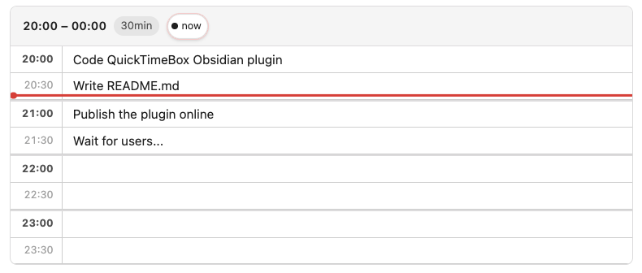
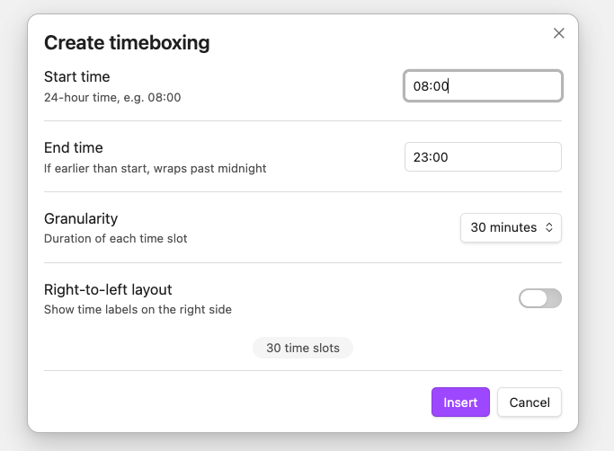

# QuickTimeBox — Obsidian Plugin

Plan your day directly inside your notes. Drop a `quicktimebox` code block anywhere in a note and get an interactive, editable timeline — no extra bloat needed.



---

## What it does

QuickTimeBox renders a structured time grid inside your Obsidian note. Each row is a time slot, you type your task directly into it. Changes are saved back to the note automatically.

---

## Features

- **Inline time grid** — a clean table of time slots rendered right inside your note, from any start time to any end time
- **Editable slots** — click any slot and type; the note updates itself automatically after you finish
- **Configurable granularity** — slots of 15, 30, 60, or 120 minutes
- **Live "now" indicator** — a red line tracks the current time across the grid, updating every minute
- **Now-line toggle** — click the `● now` button in the header to show or hide the current time marker
- **Midnight-wrap support** — ranges like `22:00–03:00` work correctly across midnight
- **RTL support** — set `"rtl": true` in the block or write in a right-to-left note; the layout mirrors automatically

---

## Installation (from source)

1. Navigate to your vault's plugins folder:
    ```
    <your-vault>/.obsidian/plugins/
    ```
2. Clone the repository:
    ```bash
    git clone https://github.com/loudinthecloud/obsidian-quick-timebox
    ```
3. Install dependencies and build:
    ```bash
    cd obsidian-quick-timebox
    npm install
    npm run build
    ```
4. Reload Obsidian
5. Go to **Settings → Community plugins**, find **QuickTimeBox**, and enable it.

---

## Usage

Use the `QuickTimeBox: Insert timeboxing` command on any note.



This will add a fenced code block with the language tag `quicktimebox`:

````
```quicktimebox
{
  "startTime": "20:00",
  "endTime": "00:00",
  "granularity": 30,
  "entries": {
    "20:00": "Code QuickTimeBox Obsidian plugin",
    "20:30": "Write README.md",
    "21:00": "Publish the plugin online",
    "21:30": "Wait for users..."
  },
  "rtl": false
}
```
````

| Field         | Description                                                           |
| ------------- | --------------------------------------------------------------------- |
| `startTime`   | Start of the timeline (`HH:MM`)                                       |
| `endTime`     | End of the timeline (`HH:MM`) — can cross midnight                    |
| `granularity` | Minutes per slot: `15`, `30`, `60`, or `120`                          |
| `entries`     | Map of `"HH:MM"` → task text (pre-filled slots)                       |
| `rtl`         | `true` to force right-to-left layout (optional)                       |
| `showNow`     | `false` to hide the current-time indicator (optional, default `true`) |

Empty slots are blank and ready to type in. You don't need to list every time slot — only the ones you want pre-filled.
